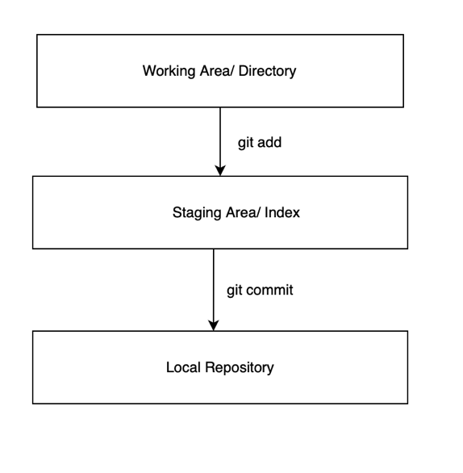
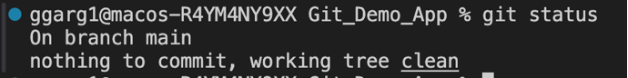
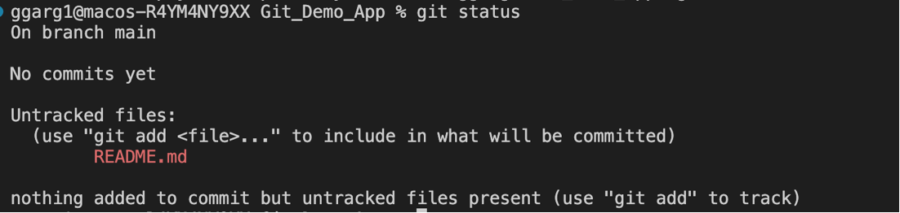
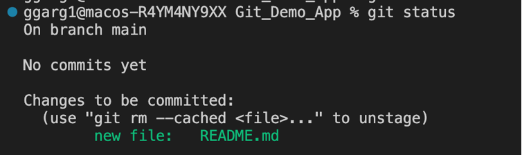
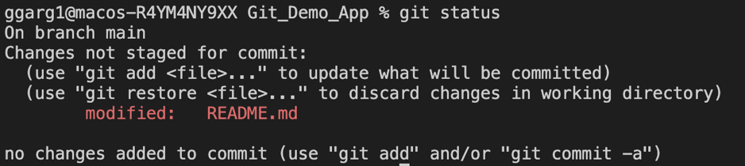
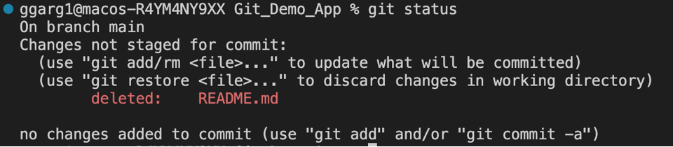
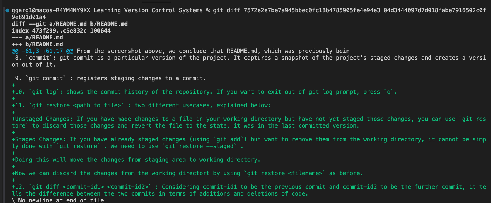

# What are Version Control Systems and why are they needed? #

What is VCS? : Version control systems are software tools that helps in recording changes made to files by keeping a track of modifications done in the code. 

Why is it needed? As we know that a software product is developed in collaboration by a group of developers they might be located at different locations and each one of them contributes to some specific kind of functionality/features. So in order to contribute to the product, they made modifications to the source code(either by adding or removing). A version control system is a software that helps the developer team to efficiently communicate and manage(track) all the changes that have been made to the source code along with the information like who made and what changes have been made. A separate branch is created for every contributor who made the changes and the changes aren’t merged into the original source code unless all are analyzed as soon as the changes are green signaled they merged to the main source code. It not only keeps source code organized but also improves productivity by making the development process smooth.

**Let's talk about Git and Github**

Git is a Version Control System (VCS) software tool. Another example of VCS tool is Mercurial.

Github is a web-based hosting service for Git repositories.

The actual version control capabilities are present in Git, Github harnesses the power of Git and hosts the Git repositories. Github is built on top of Git, and provides some extra functionalities like creating issues, feature requests etc.

Github competes with Gitlab, Bitbucket etc.

**Let's explore more about Git and Git commands**

1. `git init` : Powers the folder to be managed by Git, and initialises a new empty repository. It also creates a .git folder that has all the relevant logic to manage different versions of your project.

There are three different areas in Git: working area/directory, staging area/index and local repository. Let's learn about them:

2. `Working Area` : There can be a bunch of files that are not currently handled by git. It means that changes done or to be done in those files are not maanged by git yet. A file which is in working area is considered to be not in the staging area. When we do git status and we see a bunch of 'untracked files' then these are actually called to be in the working area.

3. `Staging area/index` : What all files are going to be a part of the next version that we will create. This staging area is the place where git knows what changes will be done from the last version to the next version.

4. `Repository area` : This area actually contains the details of all the previously registered versions. And the files in this area, git already manages them and knows their version history.

5. `git status` : It tells the state of the staging area and repository. Let's see different scenarios:

From the screenshot above, we conclude that there is nothing new to stage, and all previous changes have been committed as well. Hence, the working tree is clean.

From the screenshot above, we conclude that the file README.md is not being tracked by Git. Git is suggesting us to stage this file by using `git add`.

From the screenshot above, we conclude that the file README.md is present in the staging area and is being tracked by Git. Git is suggesting us to commit the changes.

From the screenshot above, we conclude that README.md was previously staged, but there have been some changes in README.md since the time it was last staged. We need to stage the new changes as well if we want Git to track them.

From the screenshot above, we conclude that README.md, which was previously being tracked, is now deleted.

6. `git add <file>` : Moves file from working area to staging area.

7. `git rm --cached <file>`: Moves file back from staging area to working area.

**Difference between `git rm` and `git rm --cached` or what is the use of `--cached` option?** 

`git rm --cached` removes the file only from the Git repository, but not from the filesystem. By default, the `git rm` command deletes files both from the Git repository as well as the filesystem.

8. `commit`: git commit is a particular version of the project. It captures a snapshot of the project's staged changes and creates a version out of it.

9. `git commit` : registers staging changes to a commit. 

10. `git log`: shows the commit history of the repository. If you want to exit out of git log prompt, press `q`.

11. `git restore <path to file>` : two different usecases, explained below:

Unstaged Changes: If you have made changes to a file in your working directory but have not yet staged those changes, you can use `git restore` to discard those changes and revert the file to the state, it was in the last committed version.

Staged Changes: If you have already staged changes (using `git add`) but want to remove them from the working directory, it cannot be simply done with `git restore` . We need to use `git restore --staged` .

Doing this will move the changes from staging area to working directory.

Now we can discard the changes from the working directort by using `git restore <filename>` as before.

12. `git diff <commit-id1> <commit-id2>` : Considering commit-id1 to be the previous commit and commit-id2 to be the further commit, it tells the difference between the two commits in terms of additions and deletions of code.

See example below:

From this screenshot, we can see the code additions (denoted by + sign, highlighted in green) between the two commits.